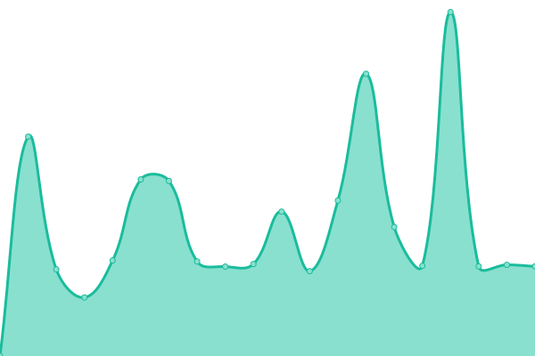

# [📈 Live Status](https://status.nelsoncollege.ac.uk): <!--live status--> **🟩 All systems operational**

<!--start: status pages-->
<!-- This summary is generated by Upptime (https://github.com/upptime/upptime) -->
<!-- Do not edit this manually, your changes will be overwritten -->
<!-- prettier-ignore -->
| URL | Status | History | Response Time | Uptime |
| --- | ------ | ------- | ------------- | ------ |
|  [Website](https://nelsoncollege.ac.uk) | 🟩 Up | [website.yml](https://github.com/travnettech/ncl_status/commits/HEAD/history/website.yml) | 

 956ms
     
 | 

<a href="https://status.nelsoncollege.ac.uk/history/website">100.00%</a>
    

|  [Virtual Learning Environment VLE](https://nclvle.co.uk) | 🟩 Up | [virtual-learning-environment-vle.yml](https://github.com/travnettech/ncl_status/commits/HEAD/history/virtual-learning-environment-vle.yml) | 

 720ms
     
 | 

<a href="https://status.nelsoncollege.ac.uk/history/virtual-learning-environment-vle">100.00%</a>
    

|  [Nelson One](https://one.nelsoncollege.ac.uk) | 🟩 Up | [nelson-one.yml](https://github.com/travnettech/ncl_status/commits/HEAD/history/nelson-one.yml) | 

 725ms
     
 | 

<a href="https://status.nelsoncollege.ac.uk/history/nelson-one">100.00%</a>
    

|  [Nelson Portal](https://portal.nelsoncollege.ac.uk) | 🟩 Up | [nelson-portal.yml](https://github.com/travnettech/ncl_status/commits/HEAD/history/nelson-portal.yml) | 

 1209ms
     
 | 

<a href="https://status.nelsoncollege.ac.uk/history/nelson-portal">100.00%</a>
    

|  [NCL Alumni Association](https://alumni.nelsoncollege.ac.uk) | 🟩 Up | [ncl-alumni-association.yml](https://github.com/travnettech/ncl_status/commits/HEAD/history/ncl-alumni-association.yml) | 

 655ms
     
 | 

<a href="https://status.nelsoncollege.ac.uk/history/ncl-alumni-association">100.00%</a>
    

<!--end: status pages-->

[**Visit our status website →**](https://status.nelsoncollege.ac.uk)
